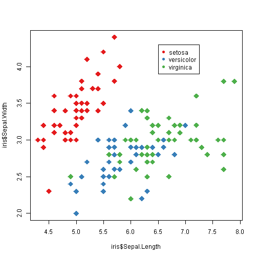
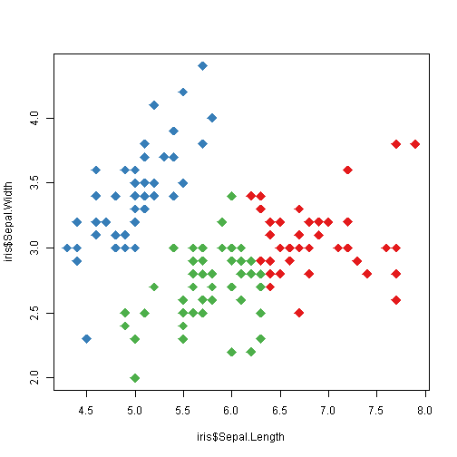

## History

### Description

The data set consists of 50 samples from each of three species of Iris (Iris setosa, Iris virginica and Iris versicolor). Four features were measured from each sample: the length and the width of the sepals and petals, in centimeters. Based on the combination of these four features, Fisher developed a linear discriminant model to distinguish the species from each other.

### Scope
The use of this data set in cluster analysis however is uncommon, since the data set only contains two clusters with rather obvious separation. One of the clusters contains Iris setosa, while the other cluster contains both Iris virginica and Iris versicolor and is not separable without the species information Fisher used. This makes the data set a good example to explain the difference between supervised and unsupervised techniques in data mining: Fisher's linear discriminant model can only be obtained when the object species are known: class labels and clusters are not necessarily the same.

Extracted from Wikipedia - https://en.wikipedia.org/wiki/Iris_flower_data_set

--- &twocol w1:60% w2:40%

## Plot
*** =left

*** =right

This plot shows the flowers grouped by the Species field, which is the botanical classification for the flowers contained in this file.

The scope of this work is to compare the biological classification with some cluster analysis done using K-means algorithm.

--- &twocol w1:60% w2:40%

## Cluster analysis K = 3
*** =left

*** =right
With K=3 the best approximation from the botanical classification was achieved, considering the field Species as the natural classifier for this file.

The only cluster that seems identical, with just some minor discrepancies, is the "Setosa" one. The other 2 "Species": "versicolor" and "virginica" are really mixed up and the Cluster Analysis result is far from the botanical classification.

---
## Conclusion

As well stated on Wikipedia article (Description slide), the use of cluster analysis in this dataset is not the best use of this algorithm, however, for this exercise the main objective is to show how shiny can be used to provide interactive experience during data analysis with a very simple example.

### In summary

Comparing the Cluster Analysis with K=3 (Plot slide), the original plot considered the field Species to group the flowers, it is possible to see that this approximation seems to be the best of all, but still very far from perfect, specially for "versicolor" and "virginica" groups. 

